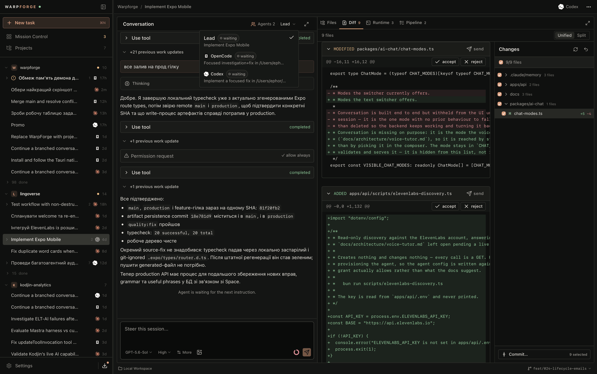
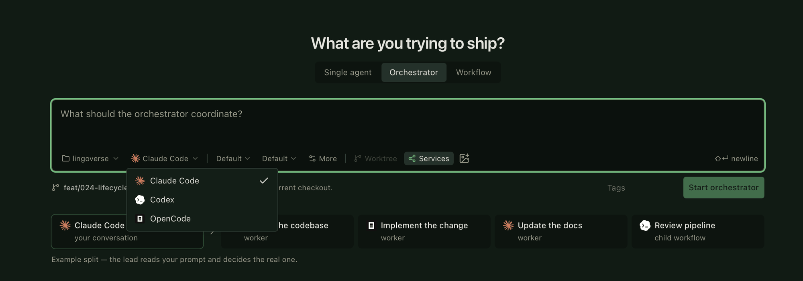
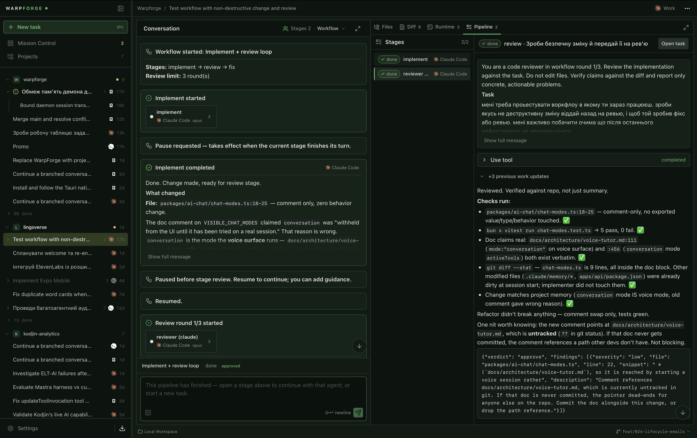

<h1 align="center">Warpforge</h1>

<h2 align="center">Run parallel coding agents without losing the workspace.</h2>

<p align="center">
  An open-source, local-first agentic development environment for Claude Code, Codex, OpenCode, and other coding agents — one workspace for agent workflows, projects, dev services, ports, files, diffs, and human review.
</p>

<p align="center">
  <a href="https://github.com/ephor/warpforge/releases/latest"></a>
  <a href="https://github.com/ephor/warpforge/actions/workflows/ci.yml"></a>
  <a href="LICENSE"></a>
</p>

<p align="center">
  <a href="#install">Install</a> ·
  <a href="https://docs.warpforge.dev">Docs</a> ·
  <a href="https://docs.warpforge.dev/concepts/why-warpforge/">Why Warpforge?</a> ·
  <a href="https://docs.warpforge.dev/concepts/agents/">Agents</a> ·
  <a href="https://docs.warpforge.dev/concepts/orchestration/">Orchestration &amp; workflows</a> ·
  <a href="https://docs.warpforge.dev/guides/projects-and-runtime/">Projects &amp; runtime</a> ·
  <a href="https://docs.warpforge.dev/getting-started/build-from-source/">Build from source</a>
</p>

<p align="center">
  
</p>

Warpforge is an **agentic development environment (ADE)**: the operating layer around your coding agents. Agent conversations, project runtime, isolated worktrees, live services, configurable multi-agent workflows, and human review live in one place — so running several agents does not turn into managing several terminals.

It does not replace Claude Code, Codex, or OpenCode; those tools still do the coding. Warpforge gives them shared project context, parallel execution, runtime visibility, and a reviewable path from prompt to commit. Everything runs on your machine: there is no separate Warpforge account or API key, and your existing agent authentication stays with the underlying CLI.

## Install

### macOS Apple Silicon

**Homebrew:**

```bash
brew install --cask ephor/tap/warpforge
```

**Or manually:**

1. Open the [latest Warpforge release](https://github.com/ephor/warpforge/releases/latest).
2. Download `Warpforge_<version>_aarch64.dmg`.
3. Open the DMG and drag **Warpforge** into **Applications**.
4. Launch it and select the coding agents you want enabled.

The build is signed with a Developer ID certificate and notarized by Apple, so it opens without Gatekeeper workarounds. It needs macOS 11 or newer on an Apple Silicon Mac and ships its own daemon — no Rust toolchain or source checkout required.

**Updates are built in and signed.** The in-app updater is the primary update channel for both install methods — Homebrew performs the initial install, and Warpforge keeps itself current afterwards (`auto_updates` is declared in the cask, so `brew upgrade` never fights the built-in updater). Warpforge checks the release feed shortly after its daemon comes up, and on demand from the app. Downloading and installing are always explicit actions — nothing installs in the background. An update carries both the desktop UI and its matching daemon, verifies an exact version and protocol handshake, and is refused with a clear list of blockers while agent tasks or runtime transitions are still active rather than interrupting work.

> [!NOTE]
> macOS on Apple Silicon is the validated desktop target. Windows and Linux packaging exists as an opt-in release preview, but those platforms have not been tested on real machines and are not claimed as publicly supported.

Two features shell out to CLIs the app doesn't bundle: **Node.js/`npm`** for one-click agent install/update, and the **[GitHub CLI](https://cli.github.com/)** (`gh`, authenticated via `gh auth login`) for **Open pull request** — commit and push don't need it. See **[Install → Requirements](https://docs.warpforge.dev/getting-started/install/#requirements-beyond-the-app-itself)** for details.

### Reuse your existing agent login

Warpforge adds no model account or API-key layer. It looks for supported agent binaries on your `PATH`, speaks the [Agent Client Protocol (ACP)](https://agentclientprotocol.com/) to them over stdio, and stores your enabled-agent selection locally. If Claude Code, Codex, or OpenCode is already installed and authenticated, that setup is reused as-is — the CLI keeps owning authentication, model access, and the coding itself.

## Why Warpforge?

AI-assisted development becomes a coordination problem long before it becomes a model problem: agents wait on each other, services collide on the same ports, logs hide in terminal tabs, and finished work scatters across chats, worktrees, and diffs. Warpforge turns that sprawl into one visible workflow — Mission Control for every session, a runtime that travels with the task, human review at the moments that matter, and an orchestrator for when a task outgrows one agent.

Read the full pitch in **[Why Warpforge?](https://docs.warpforge.dev/concepts/why-warpforge/)**

<p align="center">
  
</p>

## Bring your own agents

Warpforge detects Claude Code, Codex, OpenCode, Qwen Code, Goose, Junie, Cursor, and Pi as globally installed binaries and speaks [ACP](https://agentclientprotocol.com/) to them over stdio — no separate Warpforge account, no new API key, your existing agent login just works. Any other ACP-compatible agent can be added with a custom command.

See **[Bring your own agents](https://docs.warpforge.dev/concepts/agents/)** for the full list and setup details.

## Orchestration and workflows

A regular task is one conversation with one agent. Enable **Orchestrator** and that agent becomes a lead that can dispatch bounded sub-tasks to other harnesses and track their results in context. For repeatable work, configured **workflow pipelines** drive a fixed `plan? → implement → review ⇄ fix` sequence across stages, each with its own agent and model, pausing for human input at review limits and never committing automatically.

<p align="center">
  
</p>

Details in **[Orchestration and workflows](https://docs.warpforge.dev/concepts/orchestration/)**.

## Projects and their runtime

Register a project once and Warpforge reads or creates `.warpforge/workspace.yaml`, brings its services online in dependency order with captured logs and readiness detection, and gives every project a predictable 100-port range starting at `4000` — no more `address already in use`. A local Rust daemon owns all state behind a WebSocket API, so work survives closing the window. Review changed files as unified or split diffs, accept or reject hunks, commit, push, and open a pull request from the same workspace.

Full guide: **[Projects and their runtime](https://docs.warpforge.dev/guides/projects-and-runtime/)** · config schema: **[Configuration reference](https://docs.warpforge.dev/reference/configuration/)**

## Build from source

Only needed to develop Warpforge itself or to run it where no build is published — the [installer](#install) above is the recommended path otherwise.

```bash
git clone https://github.com/ephor/warpforge.git
cd warpforge/desktop
bun install
bun run tauri dev
```

Prerequisites, running the checks, and building a local bundle: **[Build from source](https://docs.warpforge.dev/getting-started/build-from-source/)**.

## CLI

The Rust binary manages the project registry directly and can run the daemon by hand:

```bash
warpforge add <path>        # register a project
warpforge remove <name>     # unregister it
warpforge list              # list projects and port ranges
warpforge init [path]       # create workspace config (--add also registers it)
warpforge bootstrap [path]  # generate a config interactively with an agent
```

`install.sh` installs this as `wf` from published archives (macOS Apple Silicon only for now); it does not install the desktop app. Full command reference: **[CLI reference](https://docs.warpforge.dev/reference/cli/)**.

## Current scope

Warpforge is young software, shipped and built in the open: macOS Apple Silicon is validated, Windows and Linux remain unvalidated previews, and runtime state is local to one machine. See **[Architecture and current scope](https://docs.warpforge.dev/reference/architecture/)** for the full picture.

Bug reports, design feedback, and focused pull requests are welcome. If you use Warpforge on a real multi-agent workflow, sharing what felt smooth — and what still sent you back to terminal juggling — is especially useful. Release notes live in [CHANGELOG.md](CHANGELOG.md).

## License

[MIT](LICENSE)
